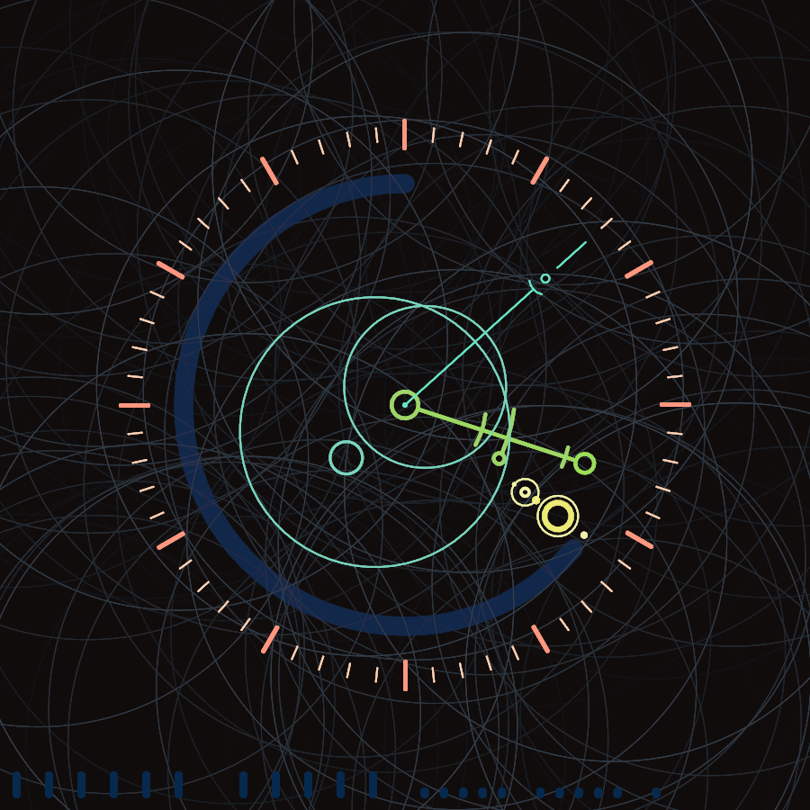
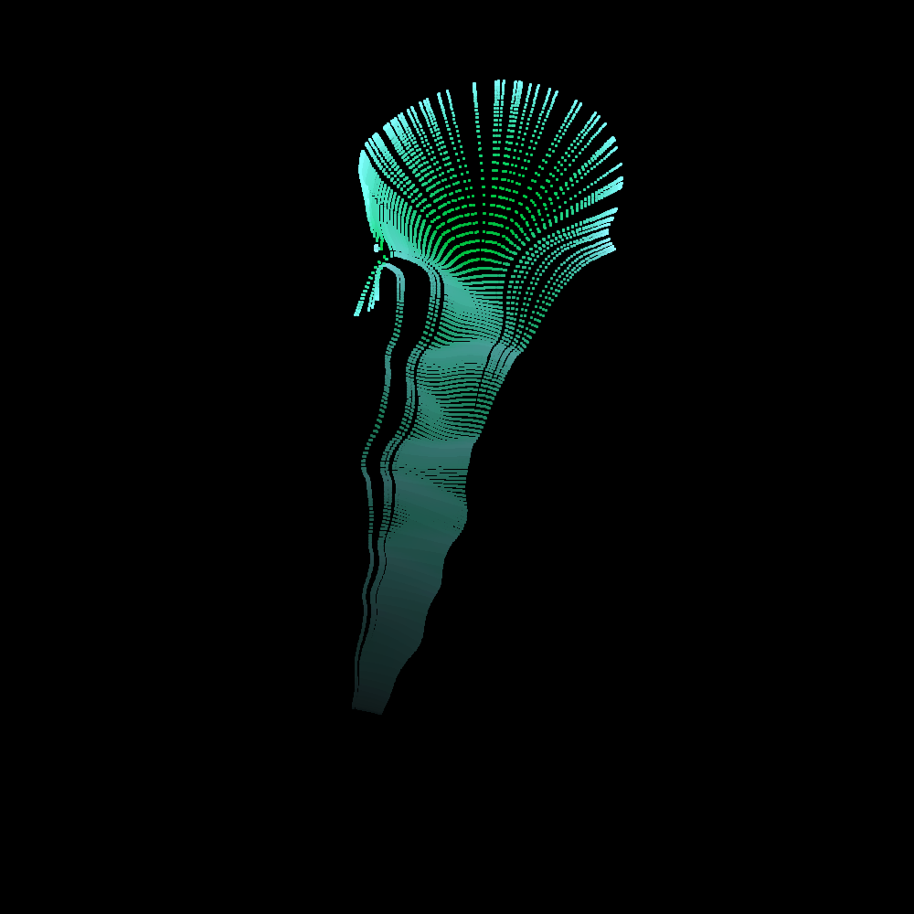
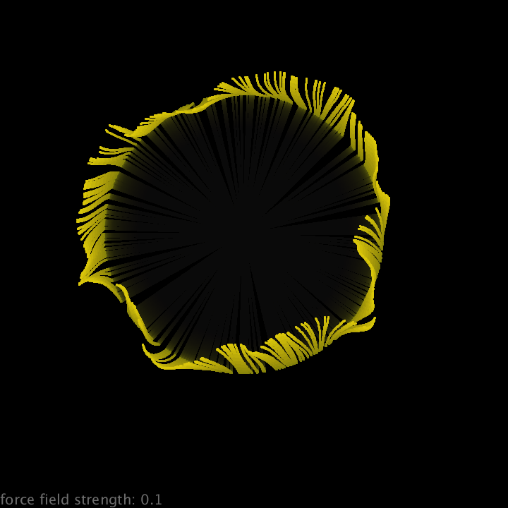

# Generative art

The process of creating art through instructions, without a direct controll.

Here is just some fun stuff I made as a part of the Generative Design Programming course at MUNI.
All of them except for the last one (Force_Brush) are made with [p5js](https://p5js.org/), therefore, you
can have a look at their deployment in GitHub pages that is linked here with each project.

## Your_Flower
The final project of the course. Only requirement was to use some user input or data from APIs.
I essentially did both. Your_Flower uses the webcamera track user's face and when they press 'G'
it sends that a picture of them to a face feature detection API (Face++). Then, it generates
a flower with random seeds based off of the returned face-featrue data.

You can try it in this [gh pages deployment](https://honzaflash.github.io/generative-art/your_flower/your_flower.html).
Or you can generate random flowers in the
[Just_Flower](https://honzaflash.github.io/generative-art/your_flower/just_flower.html)
version.

## Abstract Clock
Here the assignment was an abstract clock. Enter the project Circle Clock:\
[gh pages deployment](https://honzaflash.github.io/generative-art/abstract_clock/circle_clock.html),\
[my website deployment](https://www.fi.muni.cz/~xrychly3/gen_design/circle_clock.html).

## Patter Clock
This assignment was to make a pattern based thing. It was before the clock assignment
and I coincidentally decided to make a matrix of arrows showing time.
I am not obsessed with clocks. lul.

[gh pages deployment](https://github.com/honzaflash/generative-art/tree/main/pattern_clock.html)\
[my website deployment](https://www.fi.muni.cz/~xrychly3/gen_design/pattern_clock.html)

## Coding Diary
At the beginning of one class, we had 20 minutes to code something expressing how we were doing week.
(These artists and their feelings, uhh. jk.)
Here's the little cute thing I made [deployed on gh pages](https://honzaflash.github.io/generative-art/coding_diary/coding_diary.html).

## Force Brush
Made with Processing.
It's an app with a brush that pushes around particles leaving behind colorful traces.
Puls an optional flow field with adjustable strength.

